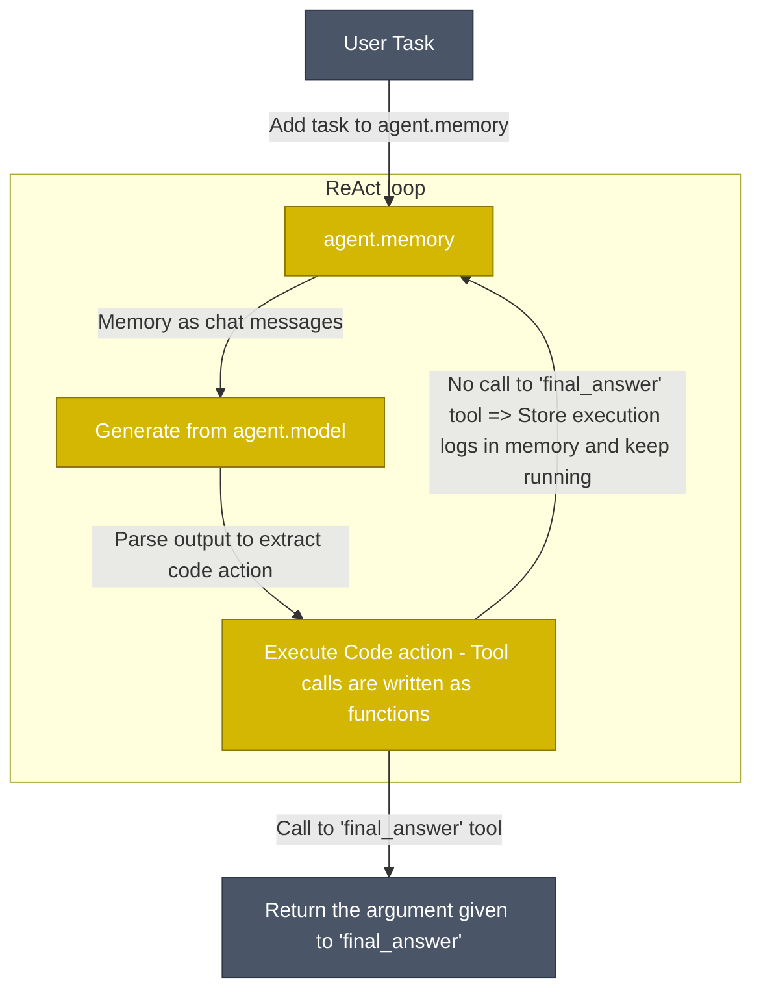

<!---
Copyright 2024 The HuggingFace Team. All rights reserved.

Licensed under the Apache License, Version 2.0 (the "License");
you may not use this file except in compliance with the License.
You may obtain a copy of the License at

    http://www.apache.org/licenses/LICENSE-2.0

Unless required by applicable law or agreed to in writing, software
distributed under the License is distributed on an "AS IS" BASIS,
WITHOUT WARRANTIES OR CONDITIONS OF ANY KIND, either express or implied.
See the License for the specific language governing permissions and
limitations under the License.
-->
<p align="center">
    <!-- Uncomment when CircleCI is set up
    <a href="https://circleci.com/gh/huggingface/accelerate"></a>
    -->
    <a href="https://github.com/huggingface/smolagents/blob/main/LICENSE"></a>
    <a href="https://huggingface.co/docs/smolagents"></a>
    <a href="https://github.com/huggingface/smolagents/releases"></a>
    <a href="https://github.com/huggingface/smolagents/blob/main/CODE_OF_CONDUCT.md"></a>
</p>

<h3 align="center">
  <div style="display:flex;flex-direction:row;">
    
    <p>A smol library to build great agents!</p>
  </div>
</h3>

`smolagents` is a library that enables you to run powerful agents in a few lines of code. It offers:

✨ **Simplicity**: the logic for agents fits in ~1,000 lines of code (see [agents.py](https://github.com/huggingface/smolagents/blob/main/src/smolagents/agents.py)). We kept abstractions to their minimal shape above raw code!

🧑‍💻 **First-class support for Code Agents**. Our [`CodeAgent`](https://huggingface.co/docs/smolagents/reference/agents#smolagents.CodeAgent) writes its actions in code (as opposed to "agents being used to write code"). To make it secure, we support executing in sandboxed environments via [E2B](https://e2b.dev/).

🤗 **Hub integrations**: you can [share/pull tools to/from the Hub](https://huggingface.co/docs/smolagents/reference/tools#smolagents.Tool.from_hub), and more is to come!

🌐 **Model-agnostic**: smolagents supports any LLM. It can be a local `transformers` or `ollama` model, one of [many providers on the Hub](https://huggingface.co/blog/inference-providers), or any model from OpenAI, Anthropic and many others via our [LiteLLM](https://www.litellm.ai/) integration.

👁️ **Modality-agnostic**: Agents support text, vision, video, even audio inputs! Cf [this tutorial](https://huggingface.co/docs/smolagents/examples/web_browser) for vision.

🛠️ **Tool-agnostic**: you can use tools from [LangChain](https://huggingface.co/docs/smolagents/reference/tools#smolagents.Tool.from_langchain), [Anthropic's MCP](https://huggingface.co/docs/smolagents/reference/tools#smolagents.ToolCollection.from_mcp), you can even use a [Hub Space](https://huggingface.co/docs/smolagents/reference/tools#smolagents.Tool.from_space) as a tool.

Full documentation can be found [here](https://huggingface.co/docs/smolagents/index).

> [!NOTE]
> Check the our [launch blog post](https://huggingface.co/blog/smolagents) to learn more about `smolagents`!

## Quick demo

First install the package.
```bash
pip install smolagents
```
Then define your agent, give it the tools it needs and run it!
```py
from smolagents import CodeAgent, DuckDuckGoSearchTool, HfApiModel

model = HfApiModel()
agent = CodeAgent(tools=[DuckDuckGoSearchTool()], model=model)

agent.run("How many seconds would it take for a leopard at full speed to run through Pont des Arts?")
```

https://github.com/user-attachments/assets/cd0226e2-7479-4102-aea0-57c22ca47884

You can even share your agent to hub:
```py
agent.push_to_hub("m-ric/my_agent")

# agent.from_hub("m-ric/my_agent") to load an agent from Hub
```

Our library is LLM-agnostic: you could switch the example above to any inference provider.

<details>
<summary> <b>HfApiModel, gateway for 4 inference providers</b></summary>

```py
from smolagents import HfApiModel

model = HfApiModel(
    model_id="deepseek-ai/DeepSeek-R1",
    provider="together",
)
```
</details>
<details>
<summary> <b>LiteLLM to access 100+ LLMs</b></summary>

```py
from smolagents import LiteLLMModel

model = LiteLLMModel(
    "anthropic/claude-3-5-sonnet-latest",
    temperature=0.2,
    api_key=os.environ["ANTHROPIC_API_KEY"]
)
```
</details>
<details>
<summary> <b>OpenAI-compatible servers</b></summary>

```py
import os
from smolagents import OpenAIServerModel

model = OpenAIServerModel(
    model_id="deepseek-ai/DeepSeek-R1",
    api_base="https://api.together.xyz/v1/", # Leave this blank to query OpenAI servers.
    api_key=os.environ["TOGETHER_API_KEY"], # Switch to the API key for the server you're targeting.
)
```
</details>
<details>
<summary> <b>Local `transformers` model</b></summary>

```py
from smolagents import TransformersModel

model = TransformersModel(
    model_id="Qwen/Qwen2.5-Coder-32B-Instruct",
    max_new_tokens=4096,
    device_map="auto"
)
```
</details>
<details>
<summary> <b>Azure models</b></summary>

```py
import os
from smolagents import AzureOpenAIServerModel

model = AzureOpenAIServerModel(
    model_id = os.environ.get("AZURE_OPENAI_MODEL"),
    azure_endpoint=os.environ.get("AZURE_OPENAI_ENDPOINT"),
    api_key=os.environ.get("AZURE_OPENAI_API_KEY"),
    api_version=os.environ.get("OPENAI_API_VERSION")    
)
```
</details>

## CLI

You can run agents from CLI using two commands: `smolagent` and `webagent`.

`smolagent` is a generalist command to run a multi-step `CodeAgent` that can be equipped with various tools.

```bash
smolagent "Plan a trip to Tokyo, Kyoto and Osaka between Mar 28 and Apr 7."  --model-type "HfApiModel" --model-id "Qwen/Qwen2.5-Coder-32B-Instruct" --imports "pandas numpy" --tools "web_search"
```

Meanwhile `webagent` is a specific web-browsing agent using [helium](https://github.com/mherrmann/helium) (read more [here](https://github.com/huggingface/smolagents/blob/main/src/smolagents/vision_web_browser.py)).

For instance:
```bash
webagent "go to xyz.com/men, get to sale section, click the first clothing item you see. Get the product details, and the price, return them. note that I'm shopping from France" --model-type "LiteLLMModel" --model-id "gpt-4o"
```

## How do Code agents work?

Our [`CodeAgent`](https://huggingface.co/docs/smolagents/reference/agents#smolagents.CodeAgent) works mostly like classical ReAct agents - the exception being that the LLM engine writes its actions as Python code snippets.



Actions are now Python code snippets. Hence, tool calls will be performed as Python function calls. For instance, here is how the agent can perform web search over several websites in one single action:
```py
requests_to_search = ["gulf of mexico america", "greenland denmark", "tariffs"]
for request in requests_to_search:
    print(f"Here are the search results for {request}:", web_search(request))
```

Writing actions as code snippets is demonstrated to work better than the current industry practice of letting the LLM output a dictionary of the tools it wants to call: [uses 30% fewer steps](https://huggingface.co/papers/2402.01030) (thus 30% fewer LLM calls) and [reaches higher performance on difficult benchmarks](https://huggingface.co/papers/2411.01747). Head to [our high-level intro to agents](https://huggingface.co/docs/smolagents/conceptual_guides/intro_agents) to learn more on that.

Especially, since code execution can be a security concern (arbitrary code execution!), we provide options at runtime:
  - a secure python interpreter to run code more safely in your environment (more secure than raw code execution but still risky)
  - a sandboxed environment using [E2B](https://e2b.dev/) (removes the risk to your own system).

On top of this [`CodeAgent`](https://huggingface.co/docs/smolagents/reference/agents#smolagents.CodeAgent) class, we still support the standard [`ToolCallingAgent`](https://huggingface.co/docs/smolagents/reference/agents#smolagents.ToolCallingAgent) that writes actions as JSON/text blobs. But we recommend always using `CodeAgent`.

## How smol is this library?

We strived to keep abstractions to a strict minimum: the main code in `agents.py` has <1,000 lines of code.
Still, we implement several types of agents: `CodeAgent` writes its actions as Python code snippets, and the more classic `ToolCallingAgent` leverages built-in tool calling methods. We also have multi-agent hierarchies, import from tool collections, remote code execution, vision models...

By the way, why use a framework at all? Well, because a big part of this stuff is non-trivial. For instance, the code agent has to keep a consistent format for code throughout its system prompt, its parser, the execution. So our framework handles this complexity for you. But of course we still encourage you to hack into the source code and use only the bits that you need, to the exclusion of everything else!

## How strong are open models for agentic workflows?

We've created [`CodeAgent`](https://huggingface.co/docs/smolagents/reference/agents#smolagents.CodeAgent) instances with some leading models, and compared them on [this benchmark](https://huggingface.co/datasets/m-ric/agents_medium_benchmark_2) that gathers questions from a few different benchmarks to propose a varied blend of challenges.

[Find the benchmarking code here](https://github.com/huggingface/smolagents/blob/main/examples/benchmark.ipynb) for more detail on the agentic setup used, and see a comparison of using LLMs code agents compared to vanilla (spoilers: code agents works better).

<p align="center">
    
</p>

This comparison shows that open-source models can now take on the best closed models!

## Contribute

Everyone is welcome to contribute, get started with our [contribution guide](https://github.com/huggingface/smolagents/blob/main/CONTRIBUTING.md).

## Cite smolagents

If you use `smolagents` in your publication, please cite it by using the following BibTeX entry.

```bibtex
@Misc{smolagents,
  title =        {`smolagents`: a smol library to build great agentic systems.},
  author =       {Aymeric Roucher and Albert Villanova del Moral and Thomas Wolf and Leandro von Werra and Erik Kaunismäki},
  howpublished = {\url{https://github.com/huggingface/smolagents}},
  year =         {2025}
}
```

# H2O Agent 與深度解釋工具整合專案

此專案整合了 H2O‑3 與 LiteLLMModel，提供一個端到端的流程來執行模型訓練、預測以及對預測結果進行詳細的原因分析與解釋。系統支援以下模式：

- **full**：完整流程（訓練 → 預測 → (可選) 深度解釋）
- **train**：僅進行模型訓練
- **predict**：僅進行預測
- **explain**：僅針對現有預測結果進行深度解釋

---

## 專案結構

- **examples/h2o_agent/main.py**  
  主要應用程式，負責解析命令列參數，依據使用者設定選擇執行模式並呼叫相應流程。  
  - 引用 [`agents/h2o_agent.py`](./agents/h2o_agent.py) 中的 `H2OAgent` 來操作 H2O‑3 模型訓練及預測
  - 根據需要，可選擇呼叫 [`tools/h2o_explain_tool.py`](./tools/h2o_explain_tool.py) 來生成詳細解釋

- **examples/h2o_agent/agents/h2o_agent.py**  
  封裝了 H2O‑3 的高階操作接口，包括：
  - 資料載入
  - 自動（AutoML）與手動模型訓練
  - 預測
  - 簡單的模型解釋（例如特徵重要性）

- **examples/h2o_agent/tools/h2o_explain_tool.py**  
  利用 LiteLLMModel 生成針對 H2O‑3 預測結果的詳細文字解釋，目前已棄用 deepseek.py，改以輕量型語言模型實現生成。

---

## 安裝與環境設定

1. **確認環境：**

   - Python 版本需 3.7 以上
   - 建議使用虛擬環境

2. **建立虛擬環境（可選）：**

   ```bash
   python -m venv venv
   source venv/bin/activate   # Linux/MacOS
   venv\Scripts\activate      # Windows
   ```

3. **安裝相依套件：**

   請確保已安裝以下 Python 套件：
   - h2o
   - python-dotenv
   - smolagents
   - litellm

   例如，可使用 pip 安裝：
   ```bash
   pip install h2o python-dotenv smolagents litellm
   ```

4. **環境變數設定：**

   建立一個 `.env` 檔案，並根據需求設定：
   - `LLM_API_BASE`：LiteLLMModel 的 API 端點（若需要使用）
   - `LLM_API_KEY`：API 金鑰（若需要使用）
   - `LLM_MODEL_ID`：LLM 模型識別碼（預設為 `gpt-3.5-turbo`）

---

## 使用說明

本專案主要以命令列方式執行，可透過調整參數來選擇不同的模式與設定。

### 命令列參數

- `--mode`  
  執行模式，選項：
  - `full`：完整流程（訓練 → 預測 → (可選) 深度解釋）
  - `train`：僅進行模型訓練
  - `predict`：僅進行預測
  - `explain`：僅進行解釋  
  (預設為 `full`)

- `--method`  
  訓練方式，選項：
  - `automl`：自動化訓練（預設）
  - `manual`：手動設定訓練參數

- `--train_data`  
  訓練資料 CSV 檔案路徑

- `--test_data`  
  測試資料 CSV 檔案路徑

- `--target`  
  目標欄位名稱

- `--params`  
  手動訓練參數（JSON 格式），例如：
  ```json
  {"ntrees": 100, "max_depth": 5}
  ```

- `--max_runtime`  
  AutoML 最大運行秒數（預設 3600 秒）

- `--model_id`  
  模型識別碼（用於預測或解釋模式）

- `--explain`  
  加入此參數表示需要針對預測結果生成深度解釋

### 範例命令

1. **完整流程**（訓練 → 預測 → 深度解釋）：
   ```bash
   python examples/h2o_agent/main.py --mode full --train_data path/to/train.csv --test_data path/to/test.csv --target target_column --explain
   ```

2. **僅進行模型訓練（自動化）**：
   ```bash
   python examples/h2o_agent/main.py --mode train --method automl --train_data path/to/train.csv --target target_column
   ```

3. **僅進行模型訓練（手動設定參數）**：
   ```bash
   python examples/h2o_agent/main.py --mode train --method manual --train_data path/to/train.csv --target target_column --params '{"ntrees": 100, "max_depth": 5}'
   ```

4. **僅進行預測**：
   ```bash
   python examples/h2o_agent/main.py --mode predict --test_data path/to/test.csv --model_id existing_model_id --explain
   ```

5. **僅針對預測結果生成深度解釋**：
   ```bash
   python examples/h2o_agent/main.py --mode explain --test_data path/to/test.csv --model_id existing_model_id
   ```

---

## 主要模組介紹

### `examples/h2o_agent/main.py`
- **功能說明：**  
  負責解析命令列參數，根據設定選擇運行模式來執行模型訓練、預測及解釋流程。
- **主要流程：**  
  1. 載入環境變數（例如 .env 設定）
  2. 初始化 H2O 群集與 `H2OAgent`
  3. 根據 `--mode` 參數選擇適當流程：
     - 訓練（`train`）
     - 預測（`predict`）
     - 解釋（`explain`）
     - 完整流程（`full`）
  4. 執行完畢後關閉 H2O 群集

### `examples/h2o_agent/agents/h2o_agent.py`
- **功能說明：**  
  提供 H2O‑3 操作的高階封裝，包含：
  - 資料載入：`load_data`
  - 自動模型訓練：`train_model_auto`
  - 手動模型訓練：`train_model_manual`
  - 預測：`predict_model`
  - 模型解釋：`explain_model`
- **使用範例：**  
  可在主程式中建立 `H2OAgent` 實例後，根據需求呼叫以上方法進行相應操作。

### `examples/h2o_agent/tools/h2o_explain_tool.py`
- **功能說明：**  
  利用 LiteLLMModel 生成根據 H2O‑3 預測結果的詳細解釋。  
- **核心接口：**  
  - `h2o_explain_tool(prediction: str, max_tokens: int = 300)`  
    根據傳入的預測結果生成自然語言解釋。
- **備註：**  
  此模組採用 smolagents 工具形式，並整合了輕量型語言模型生成功能。

---

## 注意事項

- **相依環境：**  
  執行前請先安裝所有必要的 Python 套件，並正確設定環境變數。
  
- **模型管理：**  
  在使用預測與解釋模式時，請確保 `--model_id` 為已存在於 H2O 群集中的模型識別碼。

- **資源釋放：**  
  程式在結束前會自動呼叫 `h2o.shutdown(prompt=False)`，以確保 H2O 群集資源被釋放。

---

## 結語

本專案旨在提供一個快速且方便的端到端平台，供使用者進行 H2O‑3 模型的訓練、預測以及生成深度解釋。若對專案有任何疑問或建議，歡迎提交 issue 與 pull request。

Happy Coding!
