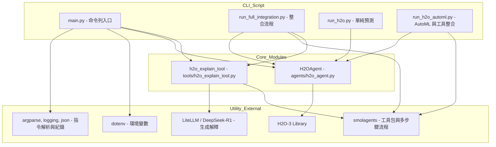

# H2O 與 DeepSeek-R1 端到端機器學習解決方案

## 簡介

本專案整合了 H2O‑3 與輕量型語言模型（LiteLLM），提供一個端到端的機器學習流程，包含以下模式：

- **full** : 完整流程（訓練 → 預測 → （可選）深度解釋）
- **train** : 僅進行模型訓練
- **predict** : 僅進行預測
- **explain** : 僅針對預測結果產生深度解釋0

使用者可以藉由命令列參數自由設定流程、資料路徑、目標欄位與訓練參數，並可根據需求採用自動化（AutoML）或手動模式進行模型訓練。此外，當啟用深度解釋功能時，系統將利用 LiteLLM 提供詳細的預測解釋。

## 程式架構圖



## 目錄結構

```
examples/h2o_agent/
├── main.py                  # 主入口程式，根據模式執行訓練、預測或解釋任務
├── agents/
│   └── h2o_agent.py         # H2O‑3 操作接口：資料載入、模型訓練、預測與基本解釋
└── tools/
    ├── h2o_explain_tool.py  # 利用 LiteLLM 生成針對模型預測結果的詳細解釋
    └── deepseek.py          # 已棄用：原 DeepSeek‑R1 推理功能，目前改由 LiteLLM 接管
```

## 環境要求

- Python 3.7 或更新版本
- 必要套件：`h2o`、`python-dotenv`、`transformers`、`smolagents`、`litellm`

## 安裝與設定

1. **建立與啟動虛擬環境**

   ```bash
   python -m venv venv
   # Linux / macOS
   source venv/bin/activate
   # Windows
   venv\Scripts\activate
   ```
2. **安裝依賴套件**

   ```bash
   pip install h2o python-dotenv transformers smolagents litellm
   ```
3. **設定環境變數（可選）**若使用深度解釋功能，請在專案根目錄建立 `.env` 檔案，並設定下列環境變數：

   - `LLM_API_BASE`：輕量型語言模型 API 的基本網址
   - `LLM_API_KEY`：API 金鑰
   - `LLM_MODEL_ID`：預設模型識別碼（預設為 `gpt-3.5-turbo`）

## 使用方法

本程式透過命令列參數決定執行模式與相關設定。主要參數說明如下：

- `--mode`：選擇執行模式：

  - `full`：完整流程（訓練 → 預測 → （可選）深度解釋）。
  - `train`：僅進行模型訓練。
  - `predict`：僅進行預測。
  - `explain`：僅針對現有預測結果產生深度解釋。
- `--method`：定義訓練模式：

  - `automl`：使用 H2OAutoML 進行自動化訓練。
  - `manual`：使用手動參數設定，預設採用 GBM 模型（如需其他算法，可自行擴充）。
- `--train_data`：訓練資料 CSV 檔案路徑。
- `--test_data`：測試資料 CSV 檔案路徑。
- `--target`：目標欄位名稱。
- `--params`：手動訓練參數（JSON 格式，例如 `{"ntrees": 100}`）。
- `--max_runtime`：AutoML 模型最大執行秒數（預設 3600 秒）。
- `--model_id`：模型識別碼（用於預測或解釋模式時指定模型）。
- `--explain`：啟用後，會對預測結果進行深度解釋（透過 LiteLLM 生成）。

### 使用範例

#### 範例一：完整流程（訓練 → 預測 → 深度解釋）

```bash
python examples/h2o_agent/main.py --mode full --method automl --train_data path/to/train.csv --test_data path/to/test.csv --target target_column --explain
```

#### 範例二：僅進行模型訓練（手動模式）

```bash
python examples/h2o_agent/main.py --mode train --method manual --train_data path/to/train.csv --target target_column --params '{"ntrees": 100}'
```

#### 範例三：僅進行預測，並自動生成深度解釋

```bash
python examples/h2o_agent/main.py --mode predict --test_data path/to/test.csv --model_id your_model_id --explain
```

#### 範例四：僅生成深度解釋

```bash
python examples/h2o_agent/main.py --mode explain --test_data path/to/test.csv --model_id your_model_id
```

## 授權條款

本專案遵循 MIT 授權條款，詳情請參閱 LICENSE 檔案。
